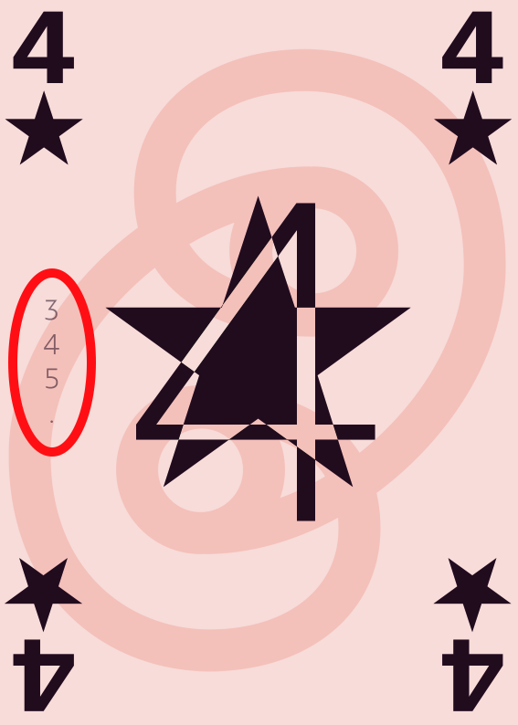

= Kod-7
:toc: preamble
:toclevels: 4
:icons: font
:stem:

A card game by Salomon BRYS.

.Components
****
* 51 game cards:
** 40 regular cards: 0 to 7 in ♠, ♥, ♣, ♦, ✿.
** 10 ★ cards: 0, 0, 1, 1, 2, 2, 3, 4, 5, 6.
** 1 Interrobang card.
* 3 double sided Exception cards: ♠, ♥/✿, ♣/♦.
****

Kod-7 plays in several rounds of 7 tricks.
You will estimate the number of tricks that you will win, with one of your own cards.
Will you have the necessary card, or will you need to adapt?

To score a maximum of points, you will have to not only take risks, but also try to make your opponent fail their own estimation.

== Setup

To create the card game deck, shuffle together all cards that show the corresponding number of players.

* 3 players: 24 cards
* 4 players: 32 cards
* 5 players: 40 cards
* 6 players: 48 cards

.Anatomy of a card
====

The "Stars 4" card is used in a 3, 4, and 5 player game but *not* in a 6 player game.
====

You should take a pencil and paper to write down estimations & scores.

== Round overview

For each round, play the following phases, in order.

1. Distribution
2. Estimation
3. Trick taking
4. Scoring

The game usually takes 7 to 9 rounds.

[[distribution]]
=== Distribution

Place the Exception cards in a pile in the centre of the table, showing the empty card on top.

Distribute 7 cards to each player.
Put aside the remaining cards (*the discard*), they won't be used for this round.

TIP: Check that the discard is composed of as many card as there are players.

=== Estimation

1. Each player chooses a card *from their hand* and puts it face down on the table.

2. When everyone has chosen a card, they reveal it.
For each player, the *value of their chosen card* defines the exact number of tricks that they *commit to win* during the round (their estimation).
+
[IMPORTANT]
====
*The sum of the estimations cannot equal 7!* +
When that is the case, restart the Estimation phase at stage 1 *leaving the previous estimation cards on the table*.
Each player must use *another card* for their estimation.

Only the last chosen card defines the player's estimation.

At the second estimation, if the sum of the estimations is still 7, all players must estimate again with a third card.

At the third estimation, the sum is allowed to equal 7.
====

3. Note on a paper sheet the estimation of each player.
+
If a player used a Star ★ card to estimate, mark their estimation with an asterisk (*) as this modifies their scoring at the end of the round.

4. Define the *first leader* and the *exception suit*:
** *If at least one player has estimated a non Star ★ card:* +
   The player who estimated *the highest non Star ★ card* becomes the first leader.
   In case of a tie, the player who has the *Interrobang* card reveals it and chooses the first leader amongst the tied players.
   The suit of the first player's estimation card defines the exception suit.
** *If all players have estimated Star ★ cards*: +
   The player who estimated *the highest card* becomes the first leader, and that player chooses the exception suit.
   In case of a tie, all tied players announce their chosen exception suit, then the player who has the *Interrobang* card reveals it and chooses the first leader amongst them.

5. Find the face of the exception suit in the Exception card stack, and place it visible on top of the stack.
It reminds all players of the exception suit for the round.

.Estimations
====
Alice estimates the *♣2*. +
Bob estimates the *♠3*. +
Carole estimates the *♠2*. +
David estimates a *★0*.

As the sum of the estimations is 7, they need to estimate again.

Alice estimates the *★3*. +
Bob estimates the *♥3*. +
Carole estimates the *♥2*. +
David estimates the *♠0*.

Bob becomes the first leader (as it has estimated the highest non ★ card) and his estimation card defines ♥ as the exception suit for the round.
====

=== Trick taking

This phase is played in *7 tricks*.
Each player will therefore play their full hand.

The first leader leads the first trick.
Each following trick is lead by the winner of the previous trick.

Each trick plays as such:

1. The leader chooses a card from their hand and plays it face up on the table.
The suit of the card is called *lead suit*.

2. In clockwise order, each other player chooses a card from their hand and plays it face up on the table.
The suit of this card *must* be of the lead suit if possible.
If you don't have a card of the lead suit, you can play *any* other card.
+
IMPORTANT: *Exception:* you can always play a Star ★ card or the Interrobang card, whether you have a card of the lead suit or not.

3. Define the trick winner:
+
--
* If there are cards of the exception suit in the trick: the player who played *the highest exception suit card* wins the trick.
* If there are no card of the exception suit in the trick, *the Interrobang card* wins the trick.
* If there are neither card of the exception suit nor the Interrobang in the trick: the player who played *the highest lead suit card* wins the trick.
--
+
IMPORTANT: The ★ cards are always *considered of the lead suit*. +
  A ★ cards is weaker than a lead suit card of the same value.
  (For example, if ♥ is the lead suit, the order is therefore 2♥ > 2★ > 1♥).
+
That player takes the cards of the trick and places them face down in front of them.
If that wasn't the 7th trick, they become the leader of the next trick.
+
Each player should place their won tricks next to each other so that *everybody can see the number of trick won by each player*.
This information is public and always visible.

Once all seven tricks have been played, tally up the scores.

=== Scoring

* Each player who *failed* their estimation *looses* as many points as difference between their estimation and the number of tricks they won.
+
NOTE: It is totally possible to have a negative score. +
At the end of the first round, at least one player will very probably have a negative score.

The sum of the points lost by the players who failed their estimation during this round makes *the basket*.

* Each player who *exactly made their estimation* scores:
** 2 points for making their estimation
** + the basket
** + 1 point for each trick they won.

.Scores
====
Following the previous example, after having played the trick-taking phase:

Alice won *3* tricks, making her estimation. +
Bob won *4* trick, failing his estimation (difference of stem:[1] trick). +
Carole didn't win any trick, failing her estimation (difference of stem:[2] tricks). +
David didn't win any trick, making his estimation.

The basket is therefore comprised of stem:[1 + 2 = 3] points.

* Players who failed their estimation:
** Bob looses stem:[1] point.
** Carole looses stem:[2] points.
* Players who made their estimation:
** Alice wins stem:[3 + 2 + 3 = 8] points.
** David wins stem:[3 + 2 + 0 = 5] points.
====

The game is played in a *minimum* of 7 rounds.
However, it is not possible to win the game with a last failure.

Beginning at the end of the 7^th^ round, the player with the highest score wins the game *if they made their estimation during the last round*.
If the player with the highest score did not make their estimation during the last round, then additional rounds are played until a winner can be designated.

To win the game, a player must therefore :

** have played at least 7 rounds,
** have made their estimation during the last round,
** have strictly the highest score.

In case of a tie for the highest score, an additional round is played.

== 2 Players

Create the card game deck as if you were playing with three players.

Both players will face each other and a third Dummy player will be simulated.

Deal a hand of 7 cards to each player.
Put the remaining cards in a pile between players: that's the *Dummy* pile.

During the estimation phase, the Dummy always estimates 2.
Therefore, if the sum of the players estimations plus 2 is 7, they need to re-estimate.
The Dummy never becomes first leader (its estimation is ignored for that purpose).

After the estimation phase, before starting the first trick, reveal 2 cards from the Dummy pile and place them face up next to it.

The Dummy always plays last (after both players), unless it has won the previous trick, in which case it opens the trick, followed by the previous leader.

The Dummy tries to win exactly 2 tricks.

Each time the Dummy plays last, reveal a third card from its pile and play one of the three revealed cards on its behalf:

* *If it wants to win the trick* (because it has won fewer than 2 tricks):
** *If it can win the trick*:
*** *If it is its first trick*: it plays the lowest card that wins the trick.
*** *If it is its second trick*: it plays the highest card that wins the trick.
** *If it cannot win the trick*: it plays the lowest possible card.
* *If it wants to lose the trick* (because it has already won 2 tricks):
** *If it can lose the trick*: it plays the highest card that looses the trick.
** *If it cannot lose the trick*: it plays the highest possible card.

If the Dummy plays first (because it won the previous trick), it plays the first card from its pile (its 2 reveal cards stay on the table).

Do not keep scores for the Dummy.
